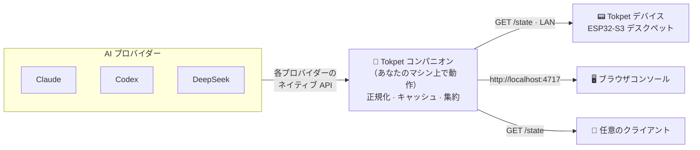

<div align="center">


# Tokpet

**あなたの AI 利用状況・クォータ・残高を、デスクペットに。🐾**

Tokpet は、あなたが連携したすべての AI プロバイダーからリアルタイムの利用状況を
読み取り、正規化して、LAN 上に単一の `GET /state` フィードとして提供する、小さな
コンパニオンサービスです。小さなデスクペットデバイス（あるいはブラウザでも、その他
なんでも）がそのフィードをポーリングし、ムードに応じたライブ表示をレンダリングします
— 余裕があるときは穏やかに、上限に近づくにつれてストレス顔に。

[](https://github.com/grpcer/tokpet/actions/workflows/ci.yml)
[](https://www.npmjs.com/package/tokpet)
[](https://nodejs.org)
[](LICENSE)
[](CONTRIBUTING.md)

[English](README.md) · [简体中文](README.zh-CN.md) · **日本語** · [한국어](README.ko.md)

<br />


</div>

---

## 📑 目次

- [Tokpet とは？](#-tokpet-とは)
- [ハイライト](#-ハイライト)
- [仕組み](#-仕組み)
- [対応プロバイダー](#-対応プロバイダー)
- [クイックスタート](#-クイックスタート)
- [サービスの管理](#-サービスの管理)
- [ハードウェア](#-ハードウェア)
- [`/state` コントラクト](#-state-コントラクト)
- [開発](#-開発)
- [ロードマップ](#-ロードマップ)
- [トラブルシューティング](#-トラブルシューティング)
- [コントリビュート](#-コントリビュート)
- [ライセンス](#-ライセンス)

## 🐾 Tokpet とは？

たいていの AI ツールは、利用状況をわざわざ開かないと見られないダッシュボードの奥に
隠してしまいます。Tokpet はそれを、いつでもさっと一目で確認できるアンビエントな存在に
変えます。

Tokpet は大きく 2 つの部分から構成されています。

- **コンパニオン** — 小さな Node.js サービスです（このリポジトリで、npm パッケージ
  [`tokpet`](https://www.npmjs.com/package/tokpet) として公開されています）。あなたの
  マシン上で動作し、各プロバイダーと通信し、大きく異なる課金モデルを 1 つの形に正規化し、
  結果をキャッシュして、単一の `GET /state` JSON エンドポイントとローカルの Web コンソールを
  公開します。
- **デバイス** — 丸型 AMOLED スクリーンを備えた ESP32-S3 のデスクペットです（このリポジトリの
  [`firmware/`](firmware/)）。LAN 経由でコンパニオンを検出し、`/state` をポーリングして、
  数値を猫の周りに光るリングとして描画します。猫のムードはあなたの利用状況のプレッシャーに
  連動します。

Tokpet を使うのにハードウェアは必要ありません — ブラウザコンソールだけで完結した
クライアントとして機能します。デバイスはあくまでお楽しみの部分です。

## ✨ ハイライト

- 🧮 **1 つのフィードに、すべてのプロバイダーを。** サブスクリプションのクォータ、API キーの
  利用額、プリペイド残高が、すべてバージョン管理された単一の `/state` コントラクトに
  集約されます。
- 🐱 **数字だけでなく、ムードで。** 利用状況は `chill` → `alert` → `stress` にマッピング
  されるので、数字を 1 つも読まなくても一目で今の状態がわかります。
- 🔒 **ローカルファーストでプライベート。** すべてがあなたのマシン上で動作します。セットアップ
  と設定の API はループバックにバインドされ、デバイスがポーリングできるよう、読み取り専用の
  `/state` フィードだけが LAN に公開されます。
- 📡 **設定不要の自動検出。** コンパニオンは mDNS（`_tokpet._tcp.local`）で自身を
  アドバタイズするので、IP を入力しなくてもデバイスが見つけてくれます。
- 🧩 **設計からしてプラガブル。** プロバイダーの追加は 1 つのディレクトリと 1 つの import
  だけ — [CONTRIBUTING.md](CONTRIBUTING.md) を参照してください。
- 🛠️ **運用は退屈なほど簡単。** Homebrew か npm でインストールし、バックグラウンドサービス
  として動かしたら、あとは忘れていて大丈夫です。

## ⚡ 仕組み



コンパニオンは有効化された各プロバイダーをポーリングし、そのデータを共通の `Usage` 形式に
マッピングして、集約したスナップショットを `GET /state` で提供します。クライアントが
プロバイダーと直接やり取りすることはなく、ただ 1 つのエンドポイントを読むだけです。Tokpet が
保証する安定性は `/state` の JSON スキーマ **だけ** なので、サードパーティ製のハードウェアや
クライアントはそれに依存できます。

## 🧩 対応プロバイダー

プロバイダーは **ベンダーが利用データをどう公開しているか** によってグループ分けされています。

| モード          | データ形式                                                            |
| --------------- | --------------------------------------------------------------------- |
| `subscription/` | リセット時刻付きのローリングウィンドウ式クォータ（例：5 時間 / 7 日） |
| `api-key/`      | 累計利用額、またはプリペイド残高                                      |
| `relay/`        | ゲートウェイごとのカスタム課金 _（予定）_                             |

**現在利用可能：**

| プロバイダー                                                          | モード         | 読み取る内容                        | 必要なもの                             |
| --------------------------------------------------------------------- | -------------- | ----------------------------------- | -------------------------------------- |
|  **Claude**     | `subscription` | 5 時間 + 7 日のローリング利用量     | 既存の Claude Code ログイン — キー不要 |
|  **Codex**      | `subscription` | 5 時間 + 7 日のローリングレート制限 | 既存の Codex CLI ログイン — キー不要   |
|  **DeepSeek** | `api-key`      | プリペイドウォレットの残高          | DeepSeek の API キー                   |

**予定：** さらなるサブスクリプション系プロバイダー（OpenAI Plus、Cursor、Windsurf…）、
API キーによる直接課金（Anthropic API、OpenAI API、Gemini…）、そしてリレーゲートウェイ
（OpenRouter、Together…）。新しいベンダーはそれぞれ `src/providers/<mode>/<id>/` 配下の
独立したディレクトリになります — コントリビュート歓迎です。

## 🚀 クイックスタート

> **要件：** [Node.js](https://nodejs.org) ≥ 20（Homebrew が自動でインストールします）。
> コンパニオンは Node.js が動作する環境ならどこでも実行できます。バックグラウンドサービスのヘルパーは現状 macOS
> （launchd）のみです。

### 1. インストール

<details open>
<summary><b>Homebrew</b>（macOS — 推奨）</summary>

```bash
brew install grpcer/tokpet/tokpet
brew services start tokpet   # runs in the background and restarts on login
```

</details>

<details>
<summary><b>npm</b>（クロスプラットフォーム）</summary>

```bash
npm install -g tokpet
tokpet service install        # background launchd service (macOS), restarts on login
# …or just run it in the foreground:
tokpet
```

</details>

<details>
<summary><b>ソースから</b>（いじりたい人向け — <a href="#-開発">開発</a> を参照）</summary>

```bash
git clone https://github.com/grpcer/tokpet.git
cd tokpet
npm install
npm run dev
```

</details>

### 2. コンソールを開く

初回起動時にはコンソールが自動で開きます。いつでも開き直すには：

```bash
tokpet open
```

…または、ブラウザで直接アクセスするだけでも開けます：

### 👉 **http://localhost:4717**

これが **Tokpet コンソール** です — ライブのダッシュボードであり、プロバイダーを追加する
場所でもあります。生の機械可読フィードはひとつ隣のパス、**http://localhost:4717/state** に
あります。

### 3. プロバイダーを追加する

コンソールで **Add provider** をクリックし、そのプロバイダーが利用状況をどう公開するか
（subscription / API キー）を選び、プロバイダーを指定して **Test** を押します。成功すると
ただちに有効化され、`/state` に現れ始めます。選択内容は `~/.tokpet/config.json` に保存され、
次回起動時に復元されます。

これで完了です — 猫があなたのトークンを見張ってくれます。🐾

## 🔧 サービスの管理

|          | Homebrew                     | npm                        |
| -------- | ---------------------------- | -------------------------- |
| **開始** | `brew services start tokpet` | `tokpet service install`   |
| **停止** | `brew services stop tokpet`  | `tokpet service uninstall` |
| **状態** | `brew services info tokpet`  | `tokpet service status`    |

CLI 全コマンド：

```text
tokpet [start]              Run the companion service in the foreground
tokpet open                 Open the console in your browser
tokpet service install      Install the background launchd service (npm users)
tokpet service uninstall    Remove the background launchd service
tokpet service status       Show the launchd service status
tokpet --version            Print the version
tokpet --help               Show help
```

> サービスは `0.0.0.0` にバインドされるため LAN 上のデバイスが `GET /state` を読み取れますが、
> セットアップと設定のルートはループバックからの呼び出しのみに制限され、ネットワークから
> アクセスされることは決してありません。

## 📟 ハードウェア

<table>
<tr>
<td width="42%" valign="top">


</td>
<td valign="top">

リファレンスデバイスは、M5Stack StopWatch ボードをベースにした **丸型スクリーンの
ESP32-S3 デスクペット** です。

- **MCU** — ESP32-S3（デュアルコア、8 MB PSRAM）
- **ディスプレイ** — CO5300 **466 × 466 丸型 AMOLED**、LVGL 9 で駆動
- **タッチ** — CST820 静電容量式
- **ネットワーク** — Wi-Fi。デバイス上でキャプティブポータルのホットスポット経由で
  セットアップします（ケーブル不要、コンパニオンの介在も不要）

起動するとデバイスは mDNS でコンパニオンを見つけ、`/state` をポーリングして、利用状況を
猫の周りの同心円リングとして描画します。猫の表情は、クォータを消費していくにつれて
穏やかなものからパニック顔へと変わっていきます。

ファームウェア一式 — ボードのブリングアップ、LVGL の「光輪猫」UI、Wi-Fi プロビジョニングの
フロー、そしてビルド/フラッシュ手順 — は **[`firmware/`](firmware/)** にあります。標準的な
ESP-IDF プロジェクトで、フラッシュは `idf.py flash` だけです。

</td>
</tr>
</table>

## 🔗 `/state` コントラクト

`GET /state` は、すべてのクライアントが拠り所とする唯一の安定したバージョン管理された
インターフェースです。トップレベルの形は次のとおりです。

```jsonc
{
  "version": 1,
  "fetchedAt": "2026-06-30T12:34:56.000Z",
  "providers": [
    {
      "id": "claude",
      "displayName": "Claude",
      "mode": "subscription",
      "result": {
        /* normalized Usage — see src/protocol/usage.ts */
      },
    },
  ],
  "primary": {
    "providerId": "claude",
    "windowId": "7d",
    "usedPct": 33,
    "mood": "chill",
  },
}
```

`primary` はデバイスがデフォルトで表示する「主役」のメトリクスで、`mood` は `usedPct` から
導出されます（`chill` < 50 ≤ `alert` < 80 ≤ `stress`）。フィールドごとの正式な定義は
TypeScript のソース [`src/protocol/state.ts`](src/protocol/state.ts) にあります。`version` は
破壊的変更があるたびにインクリメントされます。

## 🧰 開発

```bash
npm install
npm run dev            # tsx watch src/index.ts
curl http://localhost:4717/state | jq

npm run typecheck      # tsc --noEmit
npm run lint           # eslint
npm test               # vitest
npm run build          # compile to dist/
npm start              # node dist/index.js
```

プロバイダーの追加は意図的に小さく保たれています。テンプレートを
`src/providers/<mode>/<id>/` にコピーし、`id` / `displayName` / `configSchema` / `isReady` /
`fetch` を実装し、`src/providers/registry.ts` に登録して、テストを追加するだけです。詳しい
手順とハウスルールは **[CONTRIBUTING.md](CONTRIBUTING.md)** にあります。

## 🧭 ロードマップ

Tokpet はまだ若いプロジェクトですが、すでにエンドツーエンドで実用的です。

- ✅ コンパニオンサービス：セットアップコンソール、設定ストア、TTL キャッシュ、
  アグリゲーター、そして `/state` コントラクト。
- ✅ プロバイダー：Claude と Codex（subscription）、そして DeepSeek（api-key 残高）。
- ✅ Homebrew と npm 向けのバックグラウンドサービス（launchd）、コンソール内の
  「アップデートあり」通知付き。
- ✅ ファームウェア：StopWatch ボードのブリングアップ、光輪猫 UI、そしてデバイス上での
  Wi-Fi プロビジョニング。
- 🔜 3 つのモードすべてにわたる、さらなるプロバイダー（[上記](#-対応プロバイダー)を参照）。
- 🔜 subscription ログイン向けのトークンリフレッシュフロー、および Linux/Windows の
  サービスヘルパー。

## 🧯 トラブルシューティング

デバイスが「コンソールを開いてプロバイダーを追加してください」の表示から進まない、あるいは
新しいネットワークに移したあと現れなくなった？ まずは
**[TROUBLESHOOTING.md](TROUBLESHOOTING.md)** から始めてください — LAN、mDNS、そして
再プロビジョニングのチェックを順を追って説明しています。

## 🤝 コントリビュート

Issue と PR を歓迎します。まず **[CONTRIBUTING.md](CONTRIBUTING.md)** と
[行動規範](CODE_OF_CONDUCT.md) に目を通してください。最初のコントリビュートにおすすめなのは、
新しいプロバイダーをつなぎ込むことや、この README の翻訳を改善することです。

## 📜 ライセンス

[Apache-2.0](LICENSE) © Tokpet contributors。帰属表示については [NOTICE](NOTICE) を
参照してください。

<div align="center">
<br />
利用状況のページをついつい何度も更新してしまう、すべての人へ 🐾 を込めて作りました。
</div>
