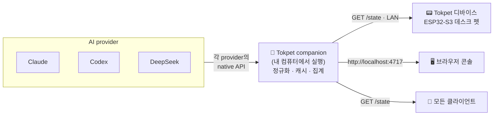

<div align="center">


# Tokpet

**AI 사용량, 할당량, 잔액을 데스크 펫으로. 🐾**

Tokpet은 연결한 모든 AI provider에서 실시간 사용량을 읽어와 정규화한 뒤,
LAN에 단일 `GET /state` 피드로 제공하는 작은 companion 서비스입니다. 작은
데스크 펫 디바이스(또는 브라우저나 그 밖의 무엇이든)가 이 피드를 폴링해서,
여유가 있을 때는 차분하고 한계에 가까워질수록 긴장하는 실시간 mood 기반 화면을
렌더링합니다.

[](https://github.com/grpcer/tokpet/actions/workflows/ci.yml)
[](https://www.npmjs.com/package/tokpet)
[](https://nodejs.org)
[](LICENSE)
[](CONTRIBUTING.md)

[English](README.md) · [简体中文](README.zh-CN.md) · [日本語](README.ja.md) · **한국어**

<br />


</div>

---

## 📑 목차

- [Tokpet이란?](#-tokpet이란)
- [주요 특징](#-주요-특징)
- [작동 방식](#-작동-방식)
- [지원하는 provider](#-지원하는-provider)
- [빠른 시작](#-빠른-시작)
- [서비스 관리](#-서비스-관리)
- [하드웨어](#-하드웨어)
- [`/state` 계약](#-state-계약)
- [개발](#-개발)
- [로드맵](#-로드맵)
- [문제 해결](#-문제-해결)
- [기여하기](#-기여하기)
- [라이선스](#-라이선스)

## 🐾 Tokpet이란?

대부분의 AI 도구는 사용량을 잊지 않고 열어봐야 하는 대시보드 뒤에 숨겨둡니다.
Tokpet은 이를 늘 곁에 있어 한눈에 확인할 수 있는 것으로 바꿔줍니다.

Tokpet은 두 부분으로 이루어져 있습니다:

- **companion** — 작은 Node.js 서비스입니다(이 저장소이며, npm 패키지
  [`tokpet`](https://www.npmjs.com/package/tokpet)로 배포됩니다). 내 컴퓨터에서
  실행되며 각 provider와 통신하고, 제각각인 과금 모델을 하나의 형태로 정규화하고,
  결과를 캐시한 뒤, 단일 `GET /state` JSON 엔드포인트와 로컬 웹 콘솔을 제공합니다.
- **디바이스** — 둥근 AMOLED 화면을 갖춘 ESP32-S3 데스크 펫입니다(이 저장소의
  [`firmware/`](firmware/)). LAN을 통해 companion을 찾아 `/state`를 폴링하고,
  숫자를 고양이 주위를 감싸는 빛나는 링으로 렌더링합니다. 이 고양이의 mood는 사용량
  압박을 따라 변합니다.

Tokpet을 쓰는 데 하드웨어가 꼭 필요한 건 아닙니다 — 브라우저 콘솔만으로도 완전한
클라이언트가 됩니다. 디바이스는 재미를 더해주는 부분이죠.

## ✨ 주요 특징

- 🧮 **하나의 피드, 모든 provider.** 구독 할당량, API key 사용액, 선불 잔액이 모두
  버전이 매겨진 단일 `/state` 계약으로 합쳐집니다.
- 🐱 **숫자가 아니라 mood로.** 사용량은 `chill` → `alert` → `stress`로 매핑되어,
  숫자 하나 읽지 않고도 한눈에 지금 상태를 알 수 있습니다.
- 🔒 **로컬 우선, 그리고 프라이빗.** 모든 것이 내 컴퓨터에서 실행됩니다. 설정·구성
  API는 loopback에 바인딩되어 있고, 디바이스가 폴링할 수 있도록 읽기 전용 `/state`
  피드만 LAN에 노출됩니다.
- 📡 **설정 없이 자동 검색.** companion이 mDNS(`_tokpet._tcp.local`)로 자신을
  광고하므로, 디바이스가 IP를 입력하지 않아도 알아서 찾아냅니다.
- 🧩 **확장 가능한 설계.** provider 하나를 추가하는 데 디렉터리 하나와 import 하나면
  됩니다 — [CONTRIBUTING.md](CONTRIBUTING.md)를 참고하세요.
- 🛠️ **운영은 지루할 만큼 단순.** Homebrew나 npm으로 설치하고, 백그라운드 서비스로
  실행한 뒤 잊어버리면 됩니다.

## ⚡ 작동 방식



companion은 활성화된 각 provider를 폴링해 그 데이터를 공통 `Usage` 형태로 매핑하고,
집계된 스냅샷을 `GET /state`로 제공합니다. 클라이언트는 provider와 직접 통신하지
않고, 단 하나의 엔드포인트만 읽으면 됩니다. Tokpet이 보장하는 **유일한** 안정성은
`/state` JSON 스키마뿐이므로, 어떤 서드파티 하드웨어나 클라이언트든 이를 신뢰하고
사용할 수 있습니다.

## 🧩 지원하는 provider

provider는 **벤더가 사용량 데이터를 어떻게 노출하는지**에 따라 분류됩니다:

| 모드            | 데이터 형태                                          |
| --------------- | ---------------------------------------------------- |
| `subscription/` | 리셋 시각이 있는 롤링 윈도우 할당량(예: 5시간 / 7일) |
| `api-key/`      | 누적 사용액 또는 선불 잔액                           |
| `relay/`        | 게이트웨이별 커스텀 과금 _(예정)_                    |

**현재 사용 가능:**

| Provider                                                              | 모드           | 읽는 데이터                 | 필요한 것                           |
| --------------------------------------------------------------------- | -------------- | --------------------------- | ----------------------------------- |
|  **Claude**     | `subscription` | 5시간 + 7일 롤링 사용량     | 기존 Claude Code 로그인 — 키 불필요 |
|  **Codex**      | `subscription` | 5시간 + 7일 롤링 rate limit | 기존 Codex CLI 로그인 — 키 불필요   |
|  **DeepSeek** | `api-key`      | 선불 지갑 잔액              | DeepSeek API 키                     |

**예정:** 더 많은 subscription provider(OpenAI Plus, Cursor, Windsurf…), 직접
API-key 과금(Anthropic API, OpenAI API, Gemini…), 그리고 relay 게이트웨이(OpenRouter,
Together…). 새 벤더는 각각 `src/providers/<mode>/<id>/` 아래의 독립된 디렉터리
하나로 구성됩니다 — 기여를 환영합니다.

## 🚀 빠른 시작

> **요구 사항:** [Node.js](https://nodejs.org) ≥ 20 (Homebrew가 함께 설치해
> 줍니다). companion은 Node.js가 동작하는 곳이면 어디서든 실행되며,
> 백그라운드 서비스 헬퍼는 현재 macOS(launchd) 전용입니다.

### 1. 설치

<details open>
<summary><b>Homebrew</b> (macOS — 권장)</summary>

```bash
brew install grpcer/tokpet/tokpet
brew services start tokpet   # runs in the background and restarts on login
```

</details>

<details>
<summary><b>npm</b> (크로스 플랫폼)</summary>

```bash
npm install -g tokpet
tokpet service install        # background launchd service (macOS), restarts on login
# …or just run it in the foreground:
tokpet
```

</details>

<details>
<summary><b>소스에서 빌드</b> (직접 수정용 — <a href="#-개발">개발</a> 참고)</summary>

```bash
git clone https://github.com/grpcer/tokpet.git
cd tokpet
npm install
npm run dev
```

</details>

### 2. 콘솔 열기

처음 실행하면 콘솔이 자동으로 열립니다. 언제든 다시 열려면:

```bash
tokpet open
```

…또는 브라우저에서 직접 접속하세요:

### 👉 **http://localhost:4717**

이것이 바로 **Tokpet 콘솔**입니다 — 실시간 대시보드이자 provider를 추가하는 곳이죠.
가공되지 않은 기계 판독용 피드는 한 경로 옆
**http://localhost:4717/state**에 있습니다.

### 3. provider 추가

콘솔에서 **Add provider**를 클릭하고, provider가 사용량을 노출하는 방식(subscription
/ API key)을 고른 뒤, provider를 선택하고 **Test**를 누르세요. 성공하면 즉시
활성화되어 `/state`에 나타나기 시작합니다. 선택한 내용은 `~/.tokpet/config.json`에
저장되고 다음 실행 때 복원됩니다.

끝입니다 — 이제 고양이가 당신의 토큰을 지켜봅니다. 🐾

## 🔧 서비스 관리

|          | Homebrew                     | npm                        |
| -------- | ---------------------------- | -------------------------- |
| **시작** | `brew services start tokpet` | `tokpet service install`   |
| **중지** | `brew services stop tokpet`  | `tokpet service uninstall` |
| **상태** | `brew services info tokpet`  | `tokpet service status`    |

전체 CLI:

```text
tokpet [start]              Run the companion service in the foreground
tokpet open                 Open the console in your browser
tokpet service install      Install the background launchd service (npm users)
tokpet service uninstall    Remove the background launchd service
tokpet service status       Show the launchd service status
tokpet --version            Print the version
tokpet --help               Show help
```

> 서비스는 `0.0.0.0`에 바인딩되어 LAN의 디바이스가 `GET /state`를 읽을 수 있게
> 하지만, 설정·구성 라우트는 loopback 호출자만 접근하도록 보호되어 있어
> 네트워크에서는 결코 닿을 수 없습니다.

## 📟 하드웨어

<table>
<tr>
<td width="42%" valign="top">


</td>
<td valign="top">

레퍼런스 디바이스는 M5Stack StopWatch 보드를 기반으로 만든 **둥근 화면의 ESP32-S3
데스크 펫**입니다:

- **MCU** — ESP32-S3 (듀얼 코어, 8 MB PSRAM)
- **디스플레이** — CO5300 **466 × 466 둥근 AMOLED**, LVGL 9으로 구동
- **터치** — CST820 정전식
- **네트워킹** — Wi-Fi, 캡티브 포털 핫스팟을 통해 디바이스에서 직접 설정(케이블
  불필요, companion 개입 없음)

부팅되면 mDNS로 companion을 찾아 `/state`를 폴링하고, 사용량을 고양이를 둘러싼
동심원 링으로 렌더링합니다. 이 고양이의 표정은 할당량을 소진해 갈수록 차분함에서
패닉으로 바뀝니다.

전체 펌웨어 — 보드 bring-up, LVGL "헤일로 고양이" UI, Wi-Fi 프로비저닝 플로우,
빌드/플래시 안내 — 는 **[`firmware/`](firmware/)**에 있습니다. 표준 ESP-IDF
프로젝트이며, 플래싱은 `idf.py flash` 한 줄이면 됩니다.

</td>
</tr>
</table>

## 🔗 `/state` 계약

`GET /state`는 모든 클라이언트가 의존하는, 안정적이고 버전이 매겨진 단 하나의
인터페이스입니다. 최상위 형태는 다음과 같습니다:

```jsonc
{
  "version": 1,
  "fetchedAt": "2026-06-30T12:34:56.000Z",
  "providers": [
    {
      "id": "claude",
      "displayName": "Claude",
      "mode": "subscription",
      "result": {
        /* normalized Usage — see src/protocol/usage.ts */
      },
    },
  ],
  "primary": {
    "providerId": "claude",
    "windowId": "7d",
    "usedPct": 33,
    "mood": "chill",
  },
}
```

`primary`는 디바이스가 기본으로 보여주는 "대표" 지표이고, `mood`는 `usedPct`에서
파생됩니다(`chill` < 50 ≤ `alert` < 80 ≤ `stress`). 필드 하나하나에 대한 권위 있는
정의는 TypeScript 소스에 있습니다: [`src/protocol/state.ts`](src/protocol/state.ts).
호환성을 깨는 변경이 있을 때마다 `version`이 올라갑니다.

## 🧰 개발

```bash
npm install
npm run dev            # tsx watch src/index.ts
curl http://localhost:4717/state | jq

npm run typecheck      # tsc --noEmit
npm run lint           # eslint
npm test               # vitest
npm run build          # compile to dist/
npm start              # node dist/index.js
```

provider 추가는 일부러 단순하게 만들어 두었습니다: 템플릿을
`src/providers/<mode>/<id>/`에 복사하고, `id` / `displayName` / `configSchema` /
`isReady` / `fetch`를 구현한 뒤, `src/providers/registry.ts`에 등록하고 테스트를
추가하면 됩니다. 전체 안내와 규칙은 **[CONTRIBUTING.md](CONTRIBUTING.md)**에
있습니다.

## 🧭 로드맵

Tokpet은 아직 어리지만, 이미 end-to-end로 충분히 쓸 만합니다.

- ✅ Companion 서비스: 설정 콘솔, 구성 저장소, TTL 캐시, 애그리게이터, 그리고
  `/state` 계약.
- ✅ Provider: Claude와 Codex (subscription), 그리고 DeepSeek (api-key 잔액).
- ✅ Homebrew와 npm을 위한 백그라운드 서비스(launchd), 콘솔 내 "업데이트 가능" 안내
  포함.
- ✅ 펌웨어: StopWatch 보드 bring-up, 헤일로 고양이 UI, 디바이스 내 Wi-Fi
  프로비저닝.
- 🔜 세 가지 모드 전반에 걸친 더 많은 provider([위 참고](#-지원하는-provider)).
- 🔜 subscription 로그인을 위한 토큰 갱신 플로우, Linux/Windows 서비스 헬퍼.

## 🧯 문제 해결

디바이스가 "open the console to add a provider"에서 멈춰 있거나, 새 네트워크로 옮긴
뒤 나타나지 않나요? **[TROUBLESHOOTING.md](TROUBLESHOOTING.md)**부터 시작하세요 —
LAN, mDNS, 재프로비저닝 점검을 단계별로 안내합니다.

## 🤝 기여하기

이슈와 PR을 환영합니다. 먼저 **[CONTRIBUTING.md](CONTRIBUTING.md)**와 [행동
강령](CODE_OF_CONDUCT.md)을 읽어 주세요. 처음 기여하기에 좋은 일: 새 provider
연결하기, 또는 이 README의 번역 개선하기.

## 📜 라이선스

[Apache-2.0](LICENSE) © Tokpet contributors. 출처 표기는 [NOTICE](NOTICE)를
참고하세요.

<div align="center">
<br />
사용량 페이지를 너무 자주 새로고침하는 모든 이들을 위해 🐾로 만들었습니다.
</div>
