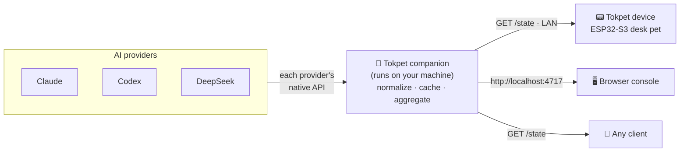

<div align="center">


# Tokpet

**Your AI usage, quota, and balance — as a desk pet. 🐾**

Tokpet is a tiny companion service that reads your real-time usage from every AI
provider you connect, normalizes it, and serves a single `GET /state` feed on
your LAN. A little desk-pet device (or your browser, or anything else) polls that
feed and renders a live, mood-driven display — calm when you have headroom,
stressed as you approach your limits.

[](https://github.com/grpcer/tokpet/actions/workflows/ci.yml)
[](https://www.npmjs.com/package/tokpet)
[](https://nodejs.org)
[](LICENSE)
[](CONTRIBUTING.md)

**English** · [简体中文](README.zh-CN.md) · [日本語](README.ja.md) · [한국어](README.ko.md)

<br />


</div>

---

## 📑 Contents

- [What is Tokpet?](#-what-is-tokpet)
- [Highlights](#-highlights)
- [How it works](#-how-it-works)
- [Supported providers](#-supported-providers)
- [Quick start](#-quick-start)
- [Managing the service](#-managing-the-service)
- [The hardware](#-the-hardware)
- [The `/state` contract](#-the-state-contract)
- [Development](#-development)
- [Roadmap](#-roadmap)
- [Troubleshooting](#-troubleshooting)
- [Contributing](#-contributing)
- [License](#-license)

## 🐾 What is Tokpet?

Most AI tools hide your usage behind a dashboard you have to remember to open.
Tokpet turns it into an ambient, glanceable thing.

It has two halves:

- **The companion** — a small Node.js service (this repo, published as the npm
  package [`tokpet`](https://www.npmjs.com/package/tokpet)). It runs on your
  machine, talks to each provider, normalizes wildly different billing models
  into one shape, caches the result, and exposes a single `GET /state` JSON
  endpoint plus a local web console.
- **The device** — an ESP32-S3 desk pet with a round AMOLED screen (this repo's
  [`firmware/`](firmware/)). It discovers the companion over your LAN, polls
  `/state`, and renders the numbers as glowing rings around a cat whose mood
  tracks your usage pressure.

You don't need the hardware to use Tokpet — the browser console is a full client
on its own. The device is the fun part.

## ✨ Highlights

- 🧮 **One feed, every provider.** Subscription quotas, API-key spend, and
  prepaid balances all collapse into a single versioned `/state` contract.
- 🐱 **Mood, not just numbers.** Usage maps to `chill` → `alert` → `stress`, so a
  glance tells you where you stand without reading a single digit.
- 🔒 **Local-first and private.** Everything runs on your machine. The setup and
  configuration API is bound to loopback; only the read-only `/state` feed is
  exposed to your LAN so the device can poll it.
- 📡 **Zero-config discovery.** The companion advertises itself over mDNS
  (`_tokpet._tcp.local`), so the device finds it without you typing an IP.
- 🧩 **Pluggable by design.** Adding a provider is one directory and one import —
  see [CONTRIBUTING.md](CONTRIBUTING.md).
- 🛠️ **Boring to operate.** Install with Homebrew or npm, run as a background
  service, and forget about it.

## ⚡ How it works



The companion polls each activated provider, maps its data onto a common
`Usage` shape, and serves the aggregate snapshot at `GET /state`. Clients never
talk to providers directly — they just read one endpoint. The **only** stability
guarantee Tokpet makes is the `/state` JSON schema, so any third-party hardware
or client can rely on it.

## 🧩 Supported providers

Providers are grouped by **how the vendor exposes usage data**:

| Mode            | Data shape                                              |
| --------------- | ------------------------------------------------------- |
| `subscription/` | Rolling-window quotas (e.g. 5 h / 7 d) with reset times |
| `api-key/`      | Cumulative spend or a prepaid balance                   |
| `relay/`        | Per-gateway custom billing _(planned)_                  |

**Available today:**

| Provider                                                              | Mode           | What it reads                      | What you need                            |
| --------------------------------------------------------------------- | -------------- | ---------------------------------- | ---------------------------------------- |
|  **Claude**     | `subscription` | 5-hour + 7-day rolling usage       | Your existing Claude Code login — no key |
|  **Codex**      | `subscription` | 5-hour + 7-day rolling rate limits | Your existing Codex CLI login — no key   |
|  **DeepSeek** | `api-key`      | Prepaid wallet balance             | A DeepSeek API key                       |

**Planned:** more subscription providers (OpenAI Plus, Cursor, Windsurf…),
direct API-key billing (Anthropic API, OpenAI API, Gemini…), and relay gateways
(OpenRouter, Together…). Each new vendor is a self-contained directory under
`src/providers/<mode>/<id>/` — contributions welcome.

## 🚀 Quick start

> **Requirements:** [Node.js](https://nodejs.org) ≥ 20 (Homebrew installs it for
> you). The companion runs anywhere Node.js does; the background-service helpers
> are macOS (launchd) only today.

### 1. Install

<details open>
<summary><b>Homebrew</b> (macOS — recommended)</summary>

```bash
brew install grpcer/tokpet/tokpet
brew services start tokpet   # runs in the background and restarts on login
```

</details>

<details>
<summary><b>npm</b> (cross-platform)</summary>

```bash
npm install -g tokpet
tokpet service install        # background launchd service (macOS), restarts on login
# …or just run it in the foreground:
tokpet
```

</details>

<details>
<summary><b>From source</b> (for hacking — see <a href="#-development">Development</a>)</summary>

```bash
git clone https://github.com/grpcer/tokpet.git
cd tokpet
npm install
npm run dev
```

</details>

### 2. Open the console

The first start opens the console automatically. To reopen it any time:

```bash
tokpet open
```

…or just visit it in your browser:

### 👉 **http://localhost:4717**

That's the **Tokpet console** — a live dashboard plus the place you add
providers. The raw, machine-readable feed lives one path over, at
**http://localhost:4717/state**.

### 3. Add a provider

In the console, click **Add provider**, choose how the provider exposes usage
(subscription / API key), pick the provider, and hit **Test**. On success it
activates immediately and starts appearing in `/state`. Your choices are saved
to `~/.tokpet/config.json` and restored on the next launch.

That's it — the cat is now watching your tokens. 🐾

## 🔧 Managing the service

|            | Homebrew                     | npm                        |
| ---------- | ---------------------------- | -------------------------- |
| **Start**  | `brew services start tokpet` | `tokpet service install`   |
| **Stop**   | `brew services stop tokpet`  | `tokpet service uninstall` |
| **Status** | `brew services info tokpet`  | `tokpet service status`    |

Full CLI:

```text
tokpet [start]              Run the companion service in the foreground
tokpet open                 Open the console in your browser
tokpet service install      Install the background launchd service (npm users)
tokpet service uninstall    Remove the background launchd service
tokpet service status       Show the launchd service status
tokpet --version            Print the version
tokpet --help               Show help
```

> The service binds `0.0.0.0` so devices on your LAN can read `GET /state`, but
> the setup and configuration routes are guarded to loopback callers only and
> are never reachable from the network.

## 📟 The hardware

<table>
<tr>
<td width="42%" valign="top">


</td>
<td valign="top">

The reference device is a **round-screen ESP32-S3 desk pet** built on the
M5Stack StopWatch board:

- **MCU** — ESP32-S3 (dual-core, 8 MB PSRAM)
- **Display** — CO5300 **466 × 466 round AMOLED**, driven by LVGL 9
- **Touch** — CST820 capacitive
- **Networking** — Wi-Fi, set up on-device through a captive-portal hotspot
  (no cables, no companion involvement)

It boots, finds the companion over mDNS, polls `/state`, and renders your usage
as concentric rings around a cat whose expression shifts from calm to panicked
as you burn through your quota.

The full firmware — board bring-up, the LVGL "halo cat" UI, the Wi-Fi
provisioning flow, and build/flash instructions — lives in
**[`firmware/`](firmware/)**. It's a standard ESP-IDF project; flashing it is
`idf.py flash`.

</td>
</tr>
</table>

## 🔗 The `/state` contract

`GET /state` is the one stable, versioned surface every client builds on. The
top-level shape:

```jsonc
{
  "version": 1,
  "fetchedAt": "2026-06-30T12:34:56.000Z",
  "providers": [
    {
      "id": "claude",
      "displayName": "Claude",
      "mode": "subscription",
      "result": {
        /* normalized Usage — see src/protocol/usage.ts */
      },
    },
  ],
  "primary": {
    "providerId": "claude",
    "windowId": "7d",
    "usedPct": 33,
    "mood": "chill",
  },
}
```

`primary` is the "hero" metric the device shows by default, and `mood` is
derived from `usedPct` (`chill` < 50 ≤ `alert` < 80 ≤ `stress`). The
authoritative, field-by-field definition is the TypeScript source:
[`src/protocol/state.ts`](src/protocol/state.ts). The `version` is bumped on any
breaking change.

## 🧰 Development

```bash
npm install
npm run dev            # tsx watch src/index.ts
curl http://localhost:4717/state | jq

npm run typecheck      # tsc --noEmit
npm run lint           # eslint
npm test               # vitest
npm run build          # compile to dist/
npm start              # node dist/index.js
```

Adding a provider is intentionally small: copy a template into
`src/providers/<mode>/<id>/`, implement `id` / `displayName` / `configSchema` /
`isReady` / `fetch`, register it in `src/providers/registry.ts`, and add a test.
The full walkthrough and house rules are in
**[CONTRIBUTING.md](CONTRIBUTING.md)**.

## 🧭 Roadmap

Tokpet is young but already useful end-to-end.

- ✅ Companion service: setup console, config store, TTL cache, aggregator, and
  the `/state` contract.
- ✅ Providers: Claude and Codex (subscription), plus DeepSeek (api-key balance).
- ✅ Background service for Homebrew and npm (launchd), with an in-console
  "update available" hint.
- ✅ Firmware: StopWatch board bring-up, the halo-cat UI, and on-device Wi-Fi
  provisioning.
- 🔜 More providers across all three modes (see [above](#-supported-providers)).
- 🔜 Token-refresh flows for subscription logins; Linux/Windows service helpers.

## 🧯 Troubleshooting

Device stuck on "open the console to add a provider", or not showing up after
you moved it to a new network? Start with
**[TROUBLESHOOTING.md](TROUBLESHOOTING.md)** — it walks through the LAN, mDNS,
and re-provisioning checks step by step.

## 🤝 Contributing

Issues and PRs are welcome. Please read
**[CONTRIBUTING.md](CONTRIBUTING.md)** and our
[Code of Conduct](CODE_OF_CONDUCT.md) first. Good first contributions: wire up a
new provider, or improve a translation of this README.

## 📜 License

[Apache-2.0](LICENSE) © the Tokpet contributors. See [NOTICE](NOTICE) for
attribution.

<div align="center">
<br />
Made with 🐾 for everyone who refreshes the usage page too often.
</div>
