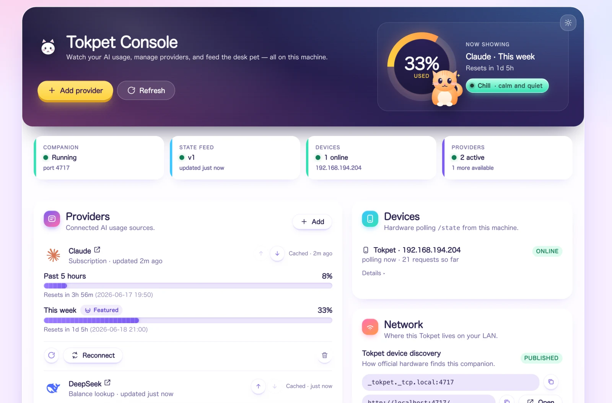
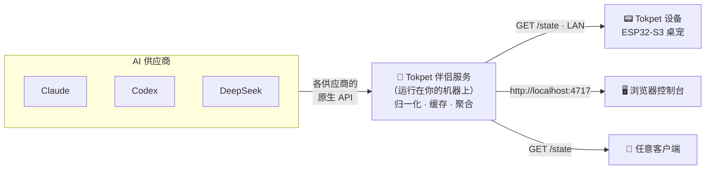
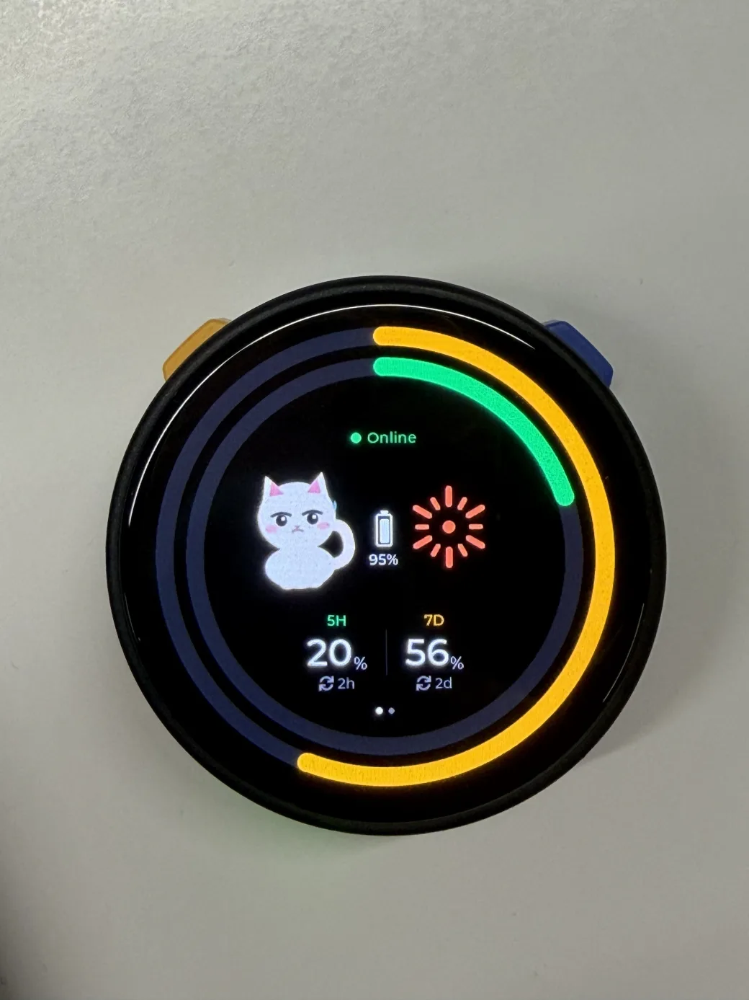

<div align="center">


# Tokpet

**你的 AI 用量、配额和余额 —— 化作一只桌宠。🐾**

Tokpet 是一个小巧的伴侣服务，它从你接入的每一个 AI 供应商读取实时用量，加以归一化，
并在你的 LAN 上提供单一的 `GET /state` 数据源。一只小小的桌宠设备（或者你的浏览器，
又或者任何别的东西）轮询这个数据源，渲染出一幅实时的、由心情驱动的画面 —— 当你还有余量时
它平静如常，当你逼近上限时它便焦虑起来。

[](https://github.com/grpcer/tokpet/actions/workflows/ci.yml)
[](https://www.npmjs.com/package/tokpet)
[](https://nodejs.org)
[](LICENSE)
[](CONTRIBUTING.md)

[English](README.md) · **简体中文** · [日本語](README.ja.md) · [한국어](README.ko.md)

<br />



</div>

---

## 📑 目录

- [Tokpet 是什么？](#-tokpet-是什么)
- [亮点](#-亮点)
- [工作原理](#-工作原理)
- [支持的供应商](#-支持的供应商)
- [快速开始](#-快速开始)
- [管理服务](#-管理服务)
- [硬件](#-硬件)
- [`/state` 数据契约](#-state-数据契约)
- [开发](#-开发)
- [路线图](#-路线图)
- [故障排查](#-故障排查)
- [贡献](#-贡献)
- [许可证](#-许可证)

## 🐾 Tokpet 是什么？

大多数 AI 工具都把你的用量藏在仪表盘背后，你得主动想起来才会去打开它。Tokpet 把它变成了
一种触手可及、一瞥即知的环境信息。

它由两半组成：

- **伴侣服务** —— 一个小巧的 Node.js 服务（即本仓库，以 npm 包
  [`tokpet`](https://www.npmjs.com/package/tokpet) 形式发布）。它运行在你的机器上，
  与各个供应商通信，把千差万别的计费模型归一化成统一的形态，缓存结果，并对外暴露单一的
  `GET /state` JSON 端点以及一个本地 Web 控制台。
- **设备** —— 一只带圆形 AMOLED 屏幕的 ESP32-S3 桌宠（即本仓库的
  [`firmware/`](firmware/)）。它通过 LAN 发现伴侣服务，轮询 `/state`，并把数字渲染成
  围绕一只猫咪的发光圆环，而这只猫的心情会随着你的用量压力一同变化。

你无需硬件也能使用 Tokpet —— 浏览器控制台本身就是一个完整的客户端。设备只是其中好玩的部分。

## ✨ 亮点

- 🧮 **一个数据源，覆盖所有供应商。** 订阅配额、API key 消费、预付余额，统统收敛进单一的、
  带版本号的 `/state` 契约。
- 🐱 **不只是数字，更是心情。** 用量会映射为 `chill` → `alert` → `stress`，一瞥之间你就知道
  自己处在什么位置，连一个数字都不用读。
- 🔒 **本地优先，注重隐私。** 一切都运行在你自己的机器上。设置与配置 API 只绑定到 loopback；
  只有只读的 `/state` 数据源会暴露到你的 LAN，供设备轮询。
- 📡 **零配置发现。** 伴侣服务通过 mDNS（`_tokpet._tcp.local`）对外广播自己，因此设备无需你
  手动输入 IP 就能找到它。
- 🧩 **可插拔的设计。** 新增一个供应商只需一个目录加一处 import ——
  参见 [CONTRIBUTING.md](CONTRIBUTING.md)。
- 🛠️ **运维省心。** 用 Homebrew 或 npm 安装，作为后台服务运行，然后就可以把它忘掉。

## ⚡ 工作原理



伴侣服务会轮询每一个已激活的供应商，把它的数据映射到统一的 `Usage` 形态上，并在
`GET /state` 提供聚合后的快照。客户端从不直接与供应商通信 —— 它们只读取这一个端点。Tokpet
**唯一**承诺保持稳定的就是 `/state` 的 JSON schema，因此任何第三方硬件或客户端都可以放心
依赖它。

## 🧩 支持的供应商

供应商按**厂商暴露用量数据的方式**分组：

| 模式            | 数据形态                                       |
| --------------- | ---------------------------------------------- |
| `subscription/` | 带重置时间的滚动窗口配额（例如 5 小时 / 7 天） |
| `api-key/`      | 累计消费或预付余额                             |
| `relay/`        | 各网关自定义计费 _（规划中）_                  |

**目前已支持：**

| 供应商                                                                | 模式           | 读取内容                  | 你需要准备                            |
| --------------------------------------------------------------------- | -------------- | ------------------------- | ------------------------------------- |
|  **Claude**     | `subscription` | 5 小时 + 7 天滚动用量     | 你现有的 Claude Code 登录 —— 无需 key |
|  **Codex**      | `subscription` | 5 小时 + 7 天滚动速率限制 | 你现有的 Codex CLI 登录 —— 无需 key   |
|  **DeepSeek** | `api-key`      | 预付钱包余额              | 一个 DeepSeek API key                 |

**规划中：** 更多订阅类供应商（OpenAI Plus、Cursor、Windsurf……）、直接的 API key 计费
（Anthropic API、OpenAI API、Gemini……），以及中继网关（OpenRouter、Together……）。
每个新厂商都是 `src/providers/<mode>/<id>/` 下的一个自包含目录 —— 欢迎贡献。

## 🚀 快速开始

> **环境要求：** [Node.js](https://nodejs.org) ≥ 20（Homebrew 会替你装好）。伴侣服务在任何能跑
> Node.js 的平台都能运行；后台服务相关的辅助工具目前仅支持 macOS（launchd）。

### 1. 安装

<details open>
<summary><b>Homebrew</b>（macOS —— 推荐）</summary>

```bash
brew install grpcer/tokpet/tokpet
brew services start tokpet   # runs in the background and restarts on login
```

</details>

<details>
<summary><b>npm</b>（跨平台）</summary>

```bash
npm install -g tokpet
tokpet service install        # background launchd service (macOS), restarts on login
# …or just run it in the foreground:
tokpet
```

</details>

<details>
<summary><b>从源码</b>（用于折腾 —— 参见 <a href="#-开发">开发</a>）</summary>

```bash
git clone https://github.com/grpcer/tokpet.git
cd tokpet
npm install
npm run dev
```

</details>

### 2. 打开控制台

首次启动会自动打开控制台。想随时重新打开它：

```bash
tokpet open
```

……或者直接在浏览器里访问：

### 👉 **http://localhost:4717**

这就是 **Tokpet 控制台** —— 一个实时仪表盘，也是你添加供应商的地方。原始的、机器可读的
数据源就在隔壁那条路径上，位于 **http://localhost:4717/state**。

### 3. 添加供应商

在控制台里点击 **Add provider**，选择该供应商暴露用量的方式（subscription / API key），
选定供应商，然后点击 **Test**。测试通过后它会立即激活，并开始出现在 `/state` 中。你的选择
会保存到 `~/.tokpet/config.json`，并在下次启动时恢复。

就是这样 —— 猫咪现在开始盯着你的 token 啦。🐾

## 🔧 管理服务

|          | Homebrew                     | npm                        |
| -------- | ---------------------------- | -------------------------- |
| **启动** | `brew services start tokpet` | `tokpet service install`   |
| **停止** | `brew services stop tokpet`  | `tokpet service uninstall` |
| **状态** | `brew services info tokpet`  | `tokpet service status`    |

完整 CLI：

```text
tokpet [start]              Run the companion service in the foreground
tokpet open                 Open the console in your browser
tokpet service install      Install the background launchd service (npm users)
tokpet service uninstall    Remove the background launchd service
tokpet service status       Show the launchd service status
tokpet --version            Print the version
tokpet --help               Show help
```

> 该服务绑定 `0.0.0.0`，以便你 LAN 中的设备可以读取 `GET /state`，但设置与配置路由
> 受到保护，只允许 loopback 调用方访问，也永远不会暴露在网络上。

## 📟 硬件

<table>
<tr>
<td width="42%" valign="top">



</td>
<td valign="top">

参考设备是一只基于 M5Stack StopWatch 开发板打造的**圆屏 ESP32-S3 桌宠**：

- **MCU** —— ESP32-S3（双核，8 MB PSRAM）
- **显示屏** —— CO5300 **466 × 466 圆形 AMOLED**，由 LVGL 9 驱动
- **触摸** —— CST820 电容式
- **网络** —— Wi-Fi，通过设备端的 captive-portal 热点完成配置
  （无需线缆，也不依赖伴侣服务）

它开机后通过 mDNS 找到伴侣服务，轮询 `/state`，并把你的用量渲染成围绕一只猫咪的同心圆环，
而这只猫的表情会随着你消耗配额而从平静变得惊慌。

完整固件 —— 开发板 bring-up、LVGL「光环猫」UI、Wi-Fi 配网流程，以及构建/烧录说明 ——
都在 **[`firmware/`](firmware/)**。它是一个标准的 ESP-IDF 项目；烧录只需
`idf.py flash`。

</td>
</tr>
</table>

## 🔗 `/state` 数据契约

`GET /state` 是每个客户端都赖以构建的、唯一稳定且带版本号的接口。其顶层结构：

```jsonc
{
  "version": 1,
  "fetchedAt": "2026-06-30T12:34:56.000Z",
  "providers": [
    {
      "id": "claude",
      "displayName": "Claude",
      "mode": "subscription",
      "result": {
        /* normalized Usage — see src/protocol/usage.ts */
      },
    },
  ],
  "primary": {
    "providerId": "claude",
    "windowId": "7d",
    "usedPct": 33,
    "mood": "chill",
  },
}
```

`primary` 是设备默认展示的「主打」指标，`mood` 则由 `usedPct` 推导而来
（`chill` < 50 ≤ `alert` < 80 ≤ `stress`）。逐字段的权威定义见 TypeScript 源码：
[`src/protocol/state.ts`](src/protocol/state.ts)。每当发生破坏性变更时，`version`
都会递增。

## 🧰 开发

```bash
npm install
npm run dev            # tsx watch src/index.ts
curl http://localhost:4717/state | jq

npm run typecheck      # tsc --noEmit
npm run lint           # eslint
npm test               # vitest
npm run build          # compile to dist/
npm start              # node dist/index.js
```

新增供应商是刻意设计得很轻量的：把一个模板复制到 `src/providers/<mode>/<id>/`，实现
`id` / `displayName` / `configSchema` / `isReady` / `fetch`，在
`src/providers/registry.ts` 中注册它，再加一个测试。完整的操作步骤和约定规范都在
**[CONTRIBUTING.md](CONTRIBUTING.md)**。

## 🧭 路线图

Tokpet 还很年轻，但已经能端到端地派上用场了。

- ✅ 伴侣服务：设置控制台、配置存储、TTL 缓存、聚合器，以及 `/state` 契约。
- ✅ 供应商：Claude 和 Codex（subscription），外加 DeepSeek（api-key 余额）。
- ✅ 面向 Homebrew 和 npm 的后台服务（launchd），并在控制台内提供「有可用更新」的提示。
- ✅ 固件：StopWatch 开发板 bring-up、光环猫 UI，以及设备端 Wi-Fi 配网。
- 🔜 在全部三种模式下支持更多供应商（见[上文](#-支持的供应商)）。
- 🔜 订阅类登录的 token 刷新流程；Linux/Windows 服务辅助工具。

## 🧯 故障排查

设备卡在「open the console to add a provider」，或者你把它挪到新网络后就不再出现了？先从
**[TROUBLESHOOTING.md](TROUBLESHOOTING.md)** 开始 —— 它会一步步带你检查 LAN、mDNS
和重新配网。

## 🤝 贡献

欢迎提交 issue 和 PR。请先阅读 **[CONTRIBUTING.md](CONTRIBUTING.md)** 和我们的
[行为准则](CODE_OF_CONDUCT.md)。适合上手的第一个贡献：接入一个新供应商，或改进本 README
的某个翻译版本。

## 📜 许可证

[Apache-2.0](LICENSE) © Tokpet 贡献者。归属说明见 [NOTICE](NOTICE)。

<div align="center">
<br />
用 🐾 为每一个总忍不住刷新用量页面的人而做。
</div>
